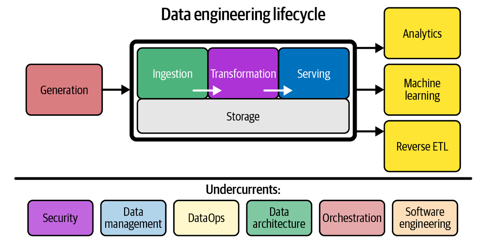

# Data Engineering Overview

This markdown file gives a brief idea about Data Engineering.

## Data Engineering Definition

According to the book [Fundamentals of Data Engineering](https://www.oreilly.com/library/view/fundamentals-of-data/9781098108298/), it is defined as the development, implementation, and maintenance of systems and processes that take in raw data and produce high-quality, consistent information that supports downstream use cases, such as analysis and machine learning.
Data engineering is the intersection of security, data management, DataOps, data architecture, orchestration, and software engineering.

## Data Engineer

A data engineer manages the data engineering lifecycle, beginning with getting data from source systems and ending with serving data for use cases, such as analysis or machine learning.

## Data Engineering Lifecycle

It is an end-to-end process of moving raw data from a source system to a target where it delivers value. The below diagram is very **important** because everything that you do in Data Engineering lies here irrespective of tools and technologies.

Following are the stages in the Data Engineering Life Cycle:

1. **Generation:** The data can be generated from various source systems such as a transactional database or an IoT device etc.
2. **Ingestion:** The raw data generated by various source systems are ingested.
3. **Storage:** The ingested data needs to be stored somewhere. There are few storage solutions like Data warehouses or some streaming frameworks which act as storage.
4. **Transformation:** After you’ve ingested and stored data, you need to change its original form into something useful for downstream use cases.
5. **Serving:** Finally, the transformed data is served to generate reports or dashboards or do ad hoc analysis on the data or build Machine Learning models.

There is an interesting concept called *"Reverse ETL"* which takes processed data
from the output side of the data engineering lifecycle and feeds it back into source
systems.

Following are the Major Undercurrents in the Data Engineering Life Cycle:

1. **Security:** Follow the principle of least privilege which means giving a user or system access to only the essential data and resources to perform an intended function.
2. **Data Management:** Data Engineers manage the data lifecycle, and data management encompasses the set of best practices that data engineers will use to accomplish this task, both technically and strategically.
3. **DataOps:** It is a set of practices that helps teams deliver accurate, reliable data faster and with fewer errors the same way DevOps helps teams deliver good software faster.
4. **Data Architecture:** It is the design of systems to support the evolving data needs of an enterprise, achieved by flexible and reversible decisions reached through a careful evaluation of trade-offs.
5. **Orchestration:** It is the process of automatically managing and scheduling multiple tasks so they run in the right order, at the right time, as smoothly as possible.
6. **Software Engineering:** Not every data source will have a ready-made plug-in to connect to it. Sometimes a data engineer has to build the connection themselves from scratch. They should be proficient in software engineering to understand APIs, pull and transform data, handle exceptions, and so forth.
