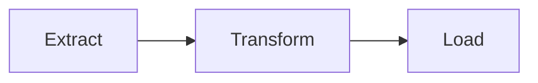
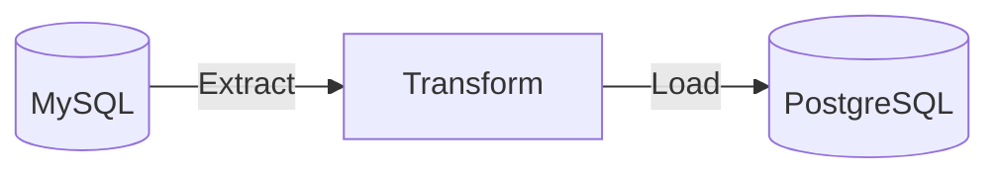

# Extract Transform Load (ETL)

It is a process of moving data from a source system to a target system at periodic intervals. The ETL process works in three steps:

1. Extract the relevant data from the source database.
2. Transform the data so that it is better suited for analytics.
3. Load the transformed data into the target database.

## Example

Let's say we have a source database MySQL that contains student information, and we want to load this data into a target database PostgreSQL for analysis. The ETL process would look like this:

