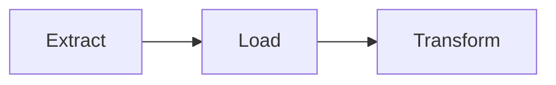
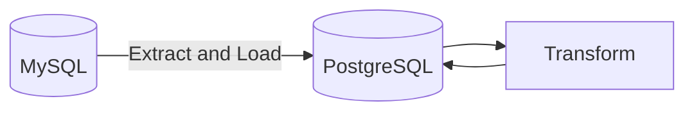

# Extract Load Transform (ELT)

Unlike ETL, where transformation happens before loading, ELT involves extracting data, loading it into the target system, and then transforming it as needed. The ELT process works in three steps:

1. Extract the relevant data from the source database.
2. Load the data into the target system.
3. Transform the data so that it is better suited for analytics.

## Example

Let's say we have a source database MySQL that contains student information, and we want to load this data into a target database PostgreSQL for analysis. The ELT process would look like this:

