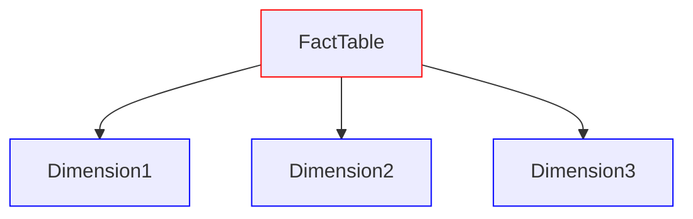
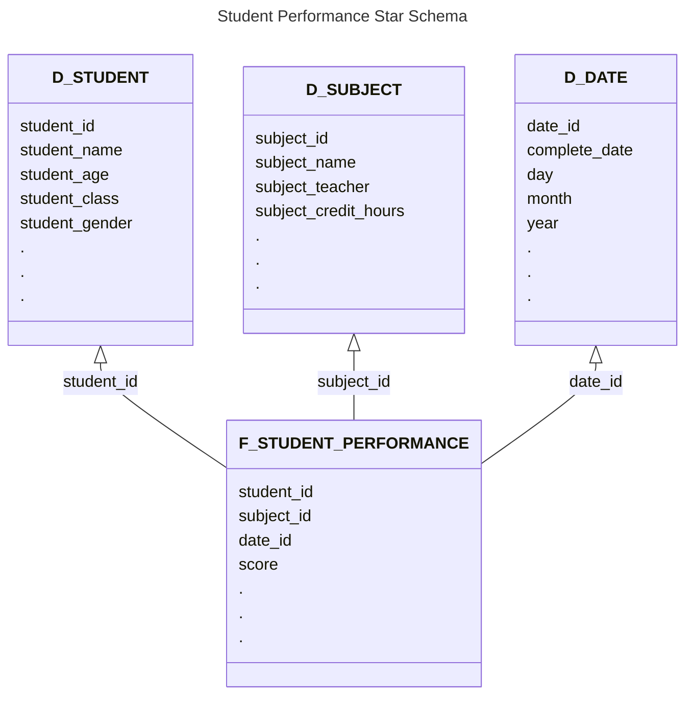
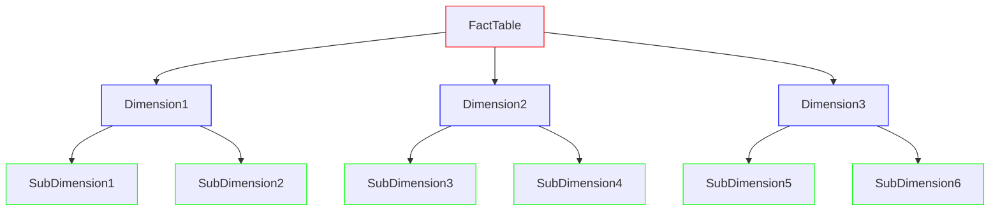
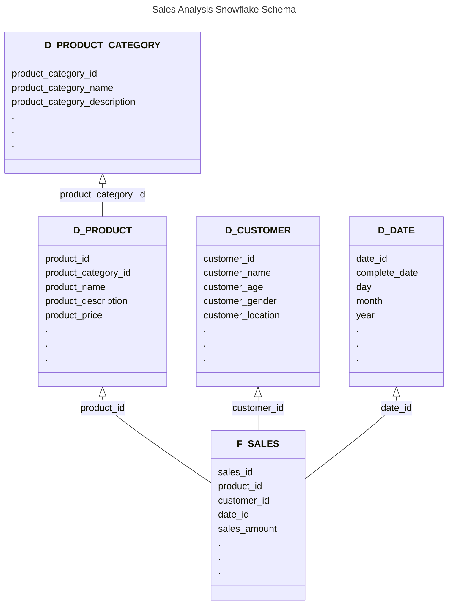

# Data Modeling

In simple terms, the process for converting data into a usable form is known as data modeling and design. It can be more challenging depending on the complexity of the data and the requirements of the project. The people who design the data model are called data architects, and they work closely with data engineers and data analysts to ensure that the data is organized in a way that is efficient and effective for analysis.

I'm not an expert in data modeling, but I frequently interact with a data modeler from the client's side in my current project. I have learned a thing or two about data modeling from my manager since she is a data architect. The point of me telling you this is that a Data Engineer usually works closely with a data modeler and hence it is important to have a good understanding of data modeling concepts and techniques.

The process of data modeling typically involves the following steps:

1. **Requirements gathering**: This is the first and most important step in the data modeling process. It involves gathering information about the data that will be used in the project, including the types of data, the sources of data, and the requirements for how the data will be used.
2. **Conceptual data modeling**: This step involves creating a high-level representation of the data, which is often done using a diagram called an Entity-Relationship (ER) diagram or a Conceptual Data Model (CDM). The ER diagram shows the entities (or objects) in the data and the relationships between them.
3. **Logical data modeling**: This step involves creating a more detailed representation of the data, which includes the attributes of the entities and the relationships between them. This is often done using a diagram called a Logical Data Model (LDM).
4. **Physical data modeling**: This step involves creating a physical representation of the data, which includes the actual tables and columns that will be used in the database. This is often done using a diagram called a Physical Data Model (PDM).

## Dimensional Modeling

Woah, what's this? Dimensional modeling is a specific type of data modeling that is used in data warehousing and business intelligence. It involves organizing data into dimensions and facts, which makes it easier to analyze and query the data. See, the Data Modeling in general is used for transactional databases, which are designed for storing and managing data for day-to-day operations. Dimensional modeling, on the other hand, is used for analytical databases, which are designed for analyzing and reporting on data.

Let us discuss the components of dimensional modeling:

1. **Facts**: They store quantitative data that can be measured and analyzed. For example, in a student performance analysis, the facts could include the scores of students in different subjects, the number of hours they studied, etc.
2. **Dimensions**: They store descriptive data that provides context for the facts. For example, in a student performance analysis, the dimensions could include the students' names, their ages, their classes, etc.

Man, I remember making CDMs and LDMs for dimensional modeling in Excel helping my manager, and it sure was a lot of work.

Anyway, in dimensional modeling, the organization of facts and dimensions is done in two main ways: star schema and snowflake schema.

### Star Schema

In a star schema, the fact table is at the center of the schema, and the dimension tables are connected to it like spokes on a wheel.

In order for a fact table to establish a relationship with a dimension table, it must have a foreign key that references the primary key of the dimension table.
Let me show you a simple example of a star schema for a student performance analysis (It is just for demonstration purpose, so don't take it too seriously) :

### Snowflake Schema

In a snowflake schema, the dimension tables are normalized, which means that they are broken down into smaller tables. This can make the schema more complex, but it can also reduce redundancy and improve query performance.

Let me show you an example of a snowflake schema for another use case, say, sales analysis:

### Slowly Changing Dimensions

As the name suggests, slowly changing dimensions (SCD) are dimensions that change slowly over time. For example, a customer's address may change over time, but their name and email may not change as frequently. There are different types of slowly changing dimensions, and the way they are handled in the data model can vary depending on the requirements of the project. The most common types of slowly changing dimensions are:

1. **Type 1**: In this type, the old value is overwritten with the new value. This means that there is no history of the changes, and only the current value is stored in the dimension table.
2. **Type 2**: In this type, a new record is created in the dimension table for each change. This means that there is a history of the changes, and both the old and new values are stored in the dimension table.
3. **Type 3**: In this type, a new column is added to the dimension table to store the old value. This means that there is a history of the changes, but only the current and previous values are stored in the dimension table.
4. **Type 4**: In this type, a new table is created to store the history of the changes. This means that there is a history of the changes, and all values are stored in the history table.
5. **Type 6**: In this type, a combination of Type 1, Type 2, and Type 3 is used to handle the changes. This means that there is a history of the changes, and both the current and previous values are stored in the dimension table, as well as a history table.

Now that you have a good idea about dimensional modeling, there is an interesting concept called data vault modeling, which is a more flexible and scalable approach to data modeling that is designed to handle large and complex data sets. This is what is used in my current project, and I will cover it in the next section.
