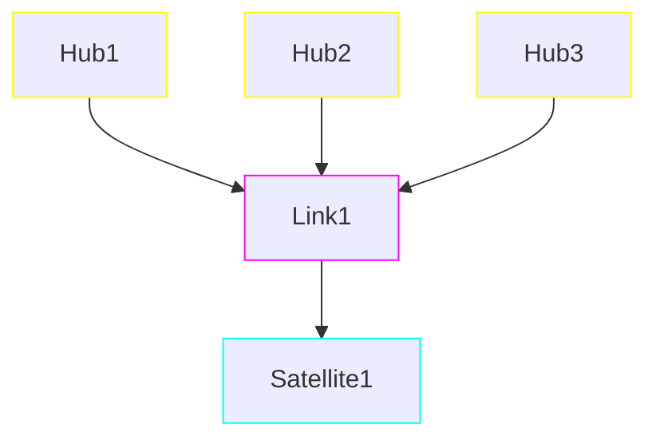
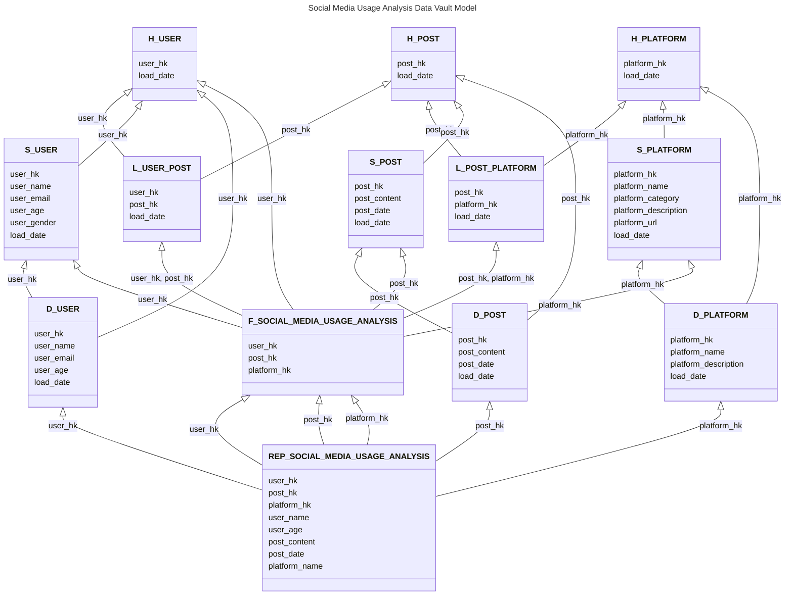

# Data Vault Modeling

I will not go deep into the details of Data Vault modeling because there is just so much to cover and even I don't know it all. I will just cover what I know and what I have learned from my experience. If you want to learn more about it, go search for "Data Vault 2.0" on the internet.

On a high level Data Vault modeling is based on the idea of separating the data into three different types of tables: Hubs, Links, and Satellites.

- **Hubs:** Hubs are the central tables that contain the unique business keys. They are also used for storing the metadata about the business keys. Hubs are the only tables that can have a primary key, and they are also the only tables that can have a surrogate key.
- **Links:** Links are the tables that contain the relationships between the Hubs. They are used to connect the Hubs together and to store the metadata about the relationships. Links can have a composite primary key, which is made up of the surrogate keys from the Hubs that they connect.
- **Satellites:** Satellites are the tables that contain the descriptive attributes. They are used to store the historical data about the business keys. Satellites can have a composite primary key, which is made up of the surrogate key from the Hub and a timestamp.

You often hear about "Raw Vault" and "Business Vault". The Raw Vault is the initial stage of the Data Vault, where the data is loaded from the source systems into the Hubs, Links, and Satellites. The Business Vault is the stage where the data is transformed and enriched to create a more business-friendly version of the data. Also, instead of ids, we use "HK" (Hash Key) for the primary keys.

The main advantage of Data Vault modeling is that it allows for a high degree of flexibility and scalability. It also allows for a high degree of data quality and consistency, as the Hubs and Links are designed to be immutable. This means that once a record is inserted into a Hub or Link, it cannot be updated or deleted. This allows for a high degree of traceability and auditability, as all changes to the data are recorded in the Satellites.

I just recently created all these hubs, links, and satellites from scratch to satisfy client's new requirement, so that is why I am able to share this knowledge with you.

Let me show you a simple example of a Data Vault model for a social media usage analysis that needs to show latest data based on the recent date. The final report should show the username, user age, post content, post date, and platform name:

Alright, I can guess the expression on your face right now haha. This is nothing, I swear to god there are way more links and satellites in my project.
