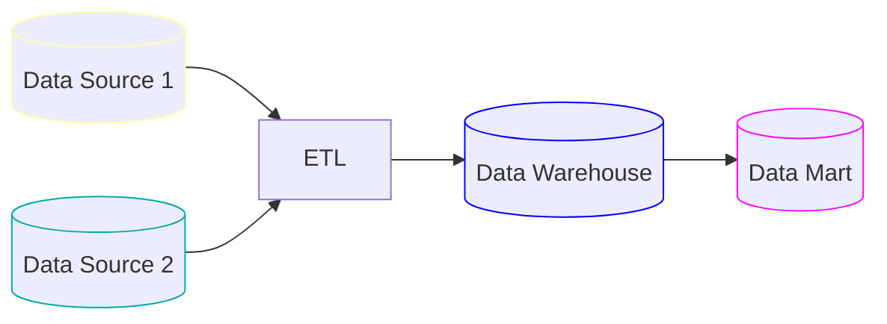

# Data Storage

When we have certain data, we need to store it somewhere. There are many different ways to store data, and the choice of storage solution depends on the specific needs. Before we dive into the different storage solutions, we need to understand the different types storage processing systems:

| Online Transaction Processing (OLTP)                                           | Online Analytical Processing (OLAP)                                                   |
| ------------------------------------------------------------------------------ | ------------------------------------------------------------------------------------- |
| Used for day-to-day operations and transactions                                | Used for data analysis and reporting                                                  |
| Optimized for fast read and write operations                                   | Optimized for complex queries and data analysis                                       |
| Tables are normalized to reduce data redundancy                                | Tables are denormalized to improve query performance                                  |
| Data volume is typically smaller than OLAP systems usually in the range of GBs | Data volume is typically larger than OLTP systems usually in the range of TBs         |
| Relational databases are commonly used for OLTP systems                        | Data warehouses and data lakes are commonly used for OLAP systems                     |
| Used in applications such as e-commerce, banking, and inventory management     | Used in applications such as business intelligence, data mining, and machine learning |
| Examples: MySQL, PostgreSQL, Oracle Database                                   | Examples: Amazon Redshift, Google BigQuery, Snowflake                                 |

Let us discuss some of the most common data storage solutions.

## Data Warehouse

It is a centralized repository that allows you to store the data from multiple sources in a structured and organized way. Data warehouse is designed for analytical processing and is optimized for query performance. It typically uses a star or snowflake schema to organize the data. The main advantage of a data warehouse is that it stores historical data, which allows for trend analysis. It is schema-on-write, which means that the data is transformed and structured before it is loaded into the warehouse.

### Data Mart

A data mart is a subset of a data warehouse that is designed for a specific business unit or department. It has smaller size than a data warehouse and is optimized to meet the needs of a specific group of users.

In my current project, we are using Snowflake as our data warehouse solution :).

## Data Lake

A data lake is also a centralized repository that allows you to store the data from multiple sources, but it is designed for raw unstructured and semi-structured data. Basically, whatever raw data you have, you can directly dump it into the data lake without worrying about the structure. Then you can perform ETL or ELT to send the data to the data warehouse. It is schema-on-read, which means that the data is transformed and structured when it is read from the lake.
