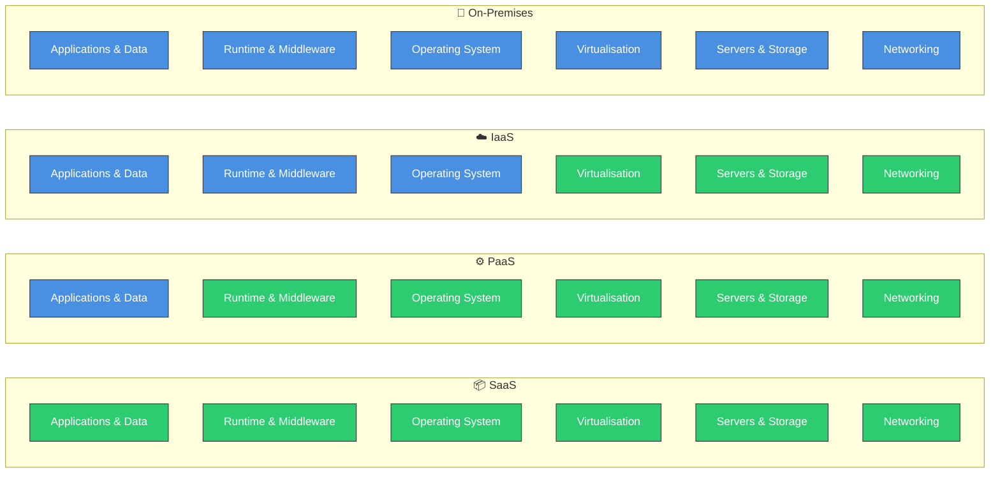

# Cloud computing services

Cloud computing services refer to the various types of services that are offered by cloud service providers to enable users to access and utilize cloud resources. There are three main types of cloud computing services:

1. **Infrastructure as a Service (IaaS)**: IaaS is a cloud computing service model that provides users with access to virtualized computing resources such as servers, storage, and networking. Users can rent these resources on a pay-as-you-go basis and have full control over the operating system and applications running on the infrastructure. Examples of IaaS providers include Amazon Web Services (AWS) EC2, Microsoft Azure Virtual Machines, and Google Cloud Compute Engine.
2. **Platform as a Service (PaaS)**: PaaS is a cloud computing service model that provides users with a platform to develop, run, and manage applications without the need to worry about the underlying infrastructure. PaaS providers offer a range of tools and services for application development, including databases, middleware, and development frameworks. Examples of PaaS providers include Microsoft Azure App Service, Google Cloud App Engine, and Heroku.
3. **Software as a Service (SaaS)**: SaaS is a cloud computing service model that provides users with access to software applications hosted on the cloud. Users can access these applications through a web browser or an API, and they do not need to worry about the underlying infrastructure or software maintenance. Examples of SaaS providers include Microsoft Office 365, Google Workspace, and Salesforce.

Now, let me provide you some information about the shared responsibility model for each of these service models:

In the above diagram, the blue boxes represent the responsibilities of the customer, while the green boxes represent the responsibilities of the cloud service provider. As you can see, as we move from on-premises to SaaS, the responsibility of the customer decreases while the responsibility of the cloud service provider increases.
