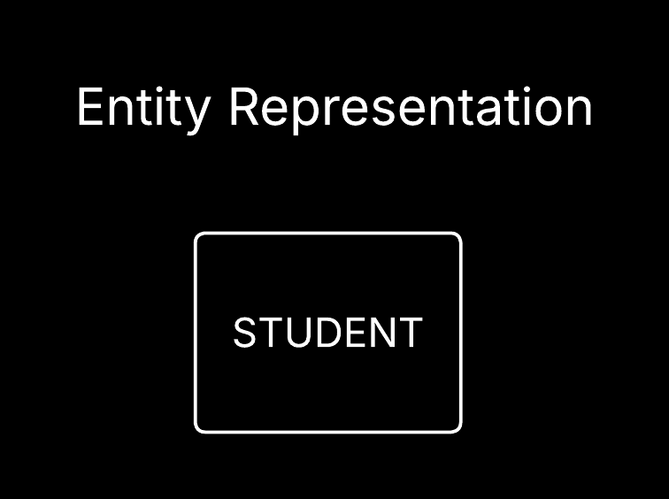
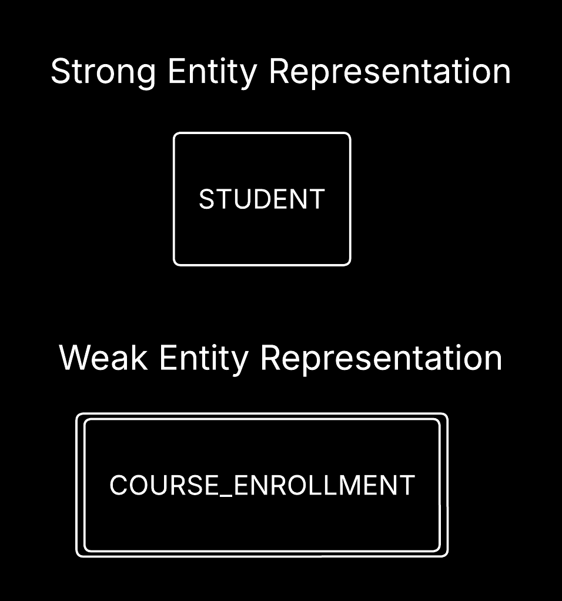
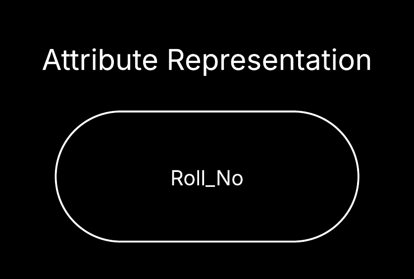
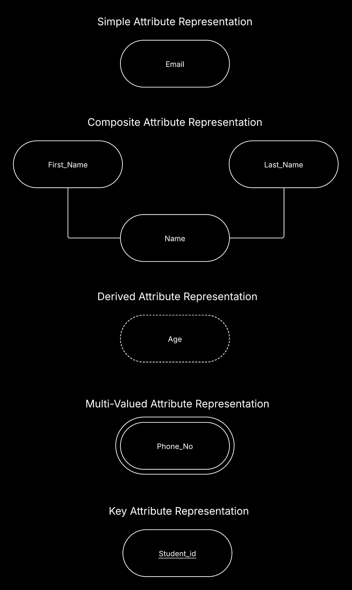
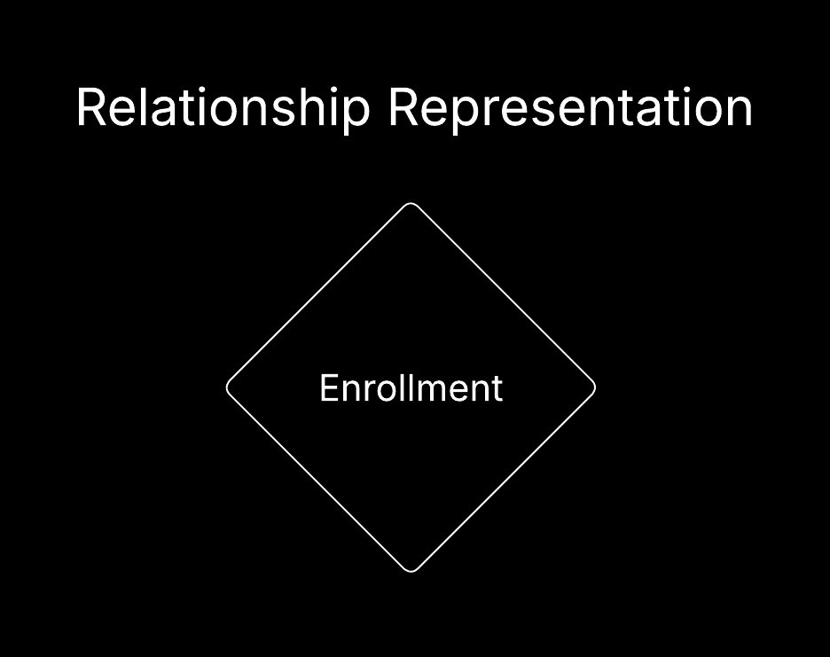
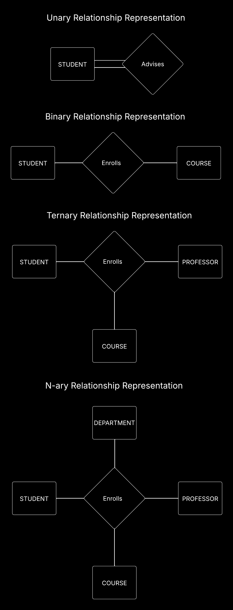
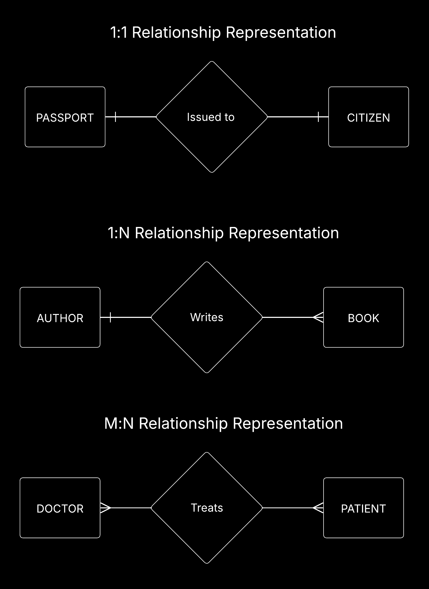
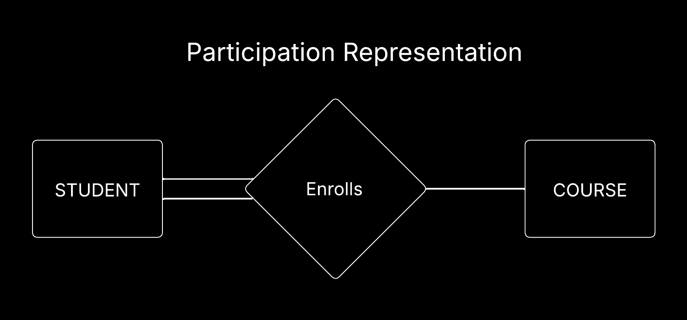

# Entity-Relationship (ER) Diagram

An Entity-Relationship (ER) Diagram is a visual representation of the entities within a system and the relationships between those entities. It is commonly used in database design to illustrate the structure of a database and how different entities interact with each other.

## Components of an ER Diagram

There are few components in an ER Diagram, and we will discuss each of them in detail.

### Entities

An entity is a real-world object, concept or a thing about which the data can be stored. The tables in a database represent entities. For example, in a university database, entities could be "Student", "Course", "Book" etc.
An entity is represented by a rectangle in an ER diagram.

An Entity Set is a collection of similar types of entities. For example, all the students in a university can be considered as an entity set.

There are two types of entities:

1. **Strong Entity:** A strong entity is an entity that can exist independently of other entities. It has a primary key that uniquely identifies each instance of the entity. For example, a "Student" entity can be considered a strong entity because it can exist independently and has a unique identifier (e.g., student ID).

2. **Weak Entity:** A weak entity is an entity that cannot exist independently and relies on a strong entity for its existence. It does not have a primary key of its own and is identified by a combination of its attributes and the primary key of the strong entity it depends on. For example, a "Course Enrollment" entity can be considered a weak entity because it cannot exist without the "Student" entity and is identified by the combination of the student ID and course ID.

In order to differentiate between strong and weak entities in an ER diagram, we use different notations. A strong entity is represented by a rectangle with a single border, while a weak entity is represented by a rectangle with a double border.

### Attributes

Attributes are the properties or characteristics of an entity. They provide more information about the entity and help to describe it in more detail. For example, for a "Student" entity, attributes could include "Student ID", "Name", "Roll No", "Age", "Major" etc. An attribute is represented by an oval in an ER diagram.

There are four types of attributes:

1. **Simple Attribute:** A simple attribute is an attribute that cannot be further divided into smaller parts. For example, "Email" is a simple attribute because it cannot be broken down into smaller components.
2. **Composite Attribute:** A composite attribute is an attribute that can be divided into smaller sub-parts. For example, "Name" can be considered a composite attribute because it can be broken down into "First Name" and "Last Name".
3. **Derived Attribute:** A derived attribute is an attribute that can be derived from other attributes. For example, "Age" can be considered a derived attribute because it can be calculated from the "Date of Birth" attribute.
4. **Multivalued Attribute:** A multivalued attribute is an attribute that can have multiple values for a single entity. For example, "Phone Number" can be considered a multivalued attribute because a person can have multiple phone numbers.
5. **Key Attribute:** A key attribute is an attribute that uniquely identifies an entity within an entity set. For example, "Student ID" can be considered a key attribute because it uniquely identifies each student in the "Student" entity set.

In order to differentiate between simple, composite, derived, and multivalued attributes in an ER diagram, we use different notations. A simple attribute is represented by a single oval, a composite attribute is represented by an oval with sub-ovals, a derived attribute is represented by a dashed oval, and a multivalued attribute is represented by a double oval, while a key attribute is represented by an oval with an underline.

### Relationships

A relationship is an association between two or more entities. It represents how entities are related to each other in the real world. For example, in a university database, a "Student" entity may have a relationship with a "Course" entity through an "Enrollment" relationship, which indicates that a student is enrolled in a course. A relationship is represented by a diamond shape in an ER diagram.

A relationship set is a collection of similar types of relationships. For example, all the enrollments between students and courses can be considered as a relationship set.

Okay, there are two concepts related to relationships that we need to understand i.e., Degree and Cardinality.

#### Degree of a Relationship

The degree of a relationship refers to the number of entities that are involved in the relationship. There are four types of relationships based on their degree:

1. **Unary Relationship:** A unary relationship is a relationship that involves only one entity. For example, in a university database, a "Student" entity may have a unary relationship with itself to represent the "Advises" relationship, where a student can advise other students.
2. **Binary Relationship:** A binary relationship is a relationship that involves two entities. For example, in a university database, a "Student" entity may have a binary relationship with a "Course" entity through an "Enrollment" relationship, which indicates that a student is enrolled in a course.
3. **Ternary Relationship:** A ternary relationship is a relationship that involves three entities. For example, in a university database, a "Student" entity may have a ternary relationship with a "Course" entity and a "Professor" entity through a "Teaches" relationship, which indicates that a professor teaches a course to students.
4. **N-ary Relationship:** An n-ary relationship is a relationship that involves more than three entities. For example, in a university database, a "Student" entity may have an n-ary relationship with a "Course" entity, a "Professor" entity, and a "Department" entity through a "Teaches" relationship, which indicates that a professor teaches a course to students in a specific department.

#### Cardinality of a Relationship

The cardinality of a relationship refers to the number of instances of one entity that can be associated with instances of another entity in a relationship. There are three types of cardinality:

1. **One-to-One (1:1):** In a one-to-one relationship, each instance of one entity is associated with at most one instance of another entity, and vice versa. For example, in a government database, a "Citizen" entity may have a one-to-one relationship with a "Passport" entity, where each citizen can have at most one passport, and each passport can be associated with at most one citizen.
2. **One-to-Many (1:N):** In a one-to-many relationship, each instance of one entity can be associated with multiple instances of another entity, but each instance of the other entity can be associated with at most one instance of the first entity. For example, in a library database, an "Author" entity may have a one-to-many relationship with a "Book" entity, where each author can write multiple books, but each book can be written by at most one author.
3. **Many-to-Many (M:N):** In a many-to-many relationship, each instance of one entity can be associated with multiple instances of another entity, and vice versa. For example, in a hospital database, a "Doctor" entity may have a many-to-many relationship with a "Patient" entity through an "Treats" relationship, where each doctor can treat multiple patients, and each patient can be treated by multiple doctors.

In order to differentiate between one-to-one, one-to-many, and many-to-many relationships in an ER diagram, we use different notations. A one-to-one relationship is represented by a single line connecting the entities, a one-to-many relationship is represented by a line with a crow's foot at the end of the entity that can have multiple instances, and a many-to-many relationship is represented by a line with crow's feet at both ends.

#### Participation of an Entity in a Relationship

The participation of an entity in a relationship refers to whether all instances of the entity are involved in the relationship or only some instances. There are two types of participation:

1. **Total Participation:** In total participation, all instances of an entity are involved in the relationship. For example, in a university database, a "Student" entity may have total participation in an "Enrollment" relationship with a "Course" entity, where every student must be enrolled in at least one course.
2. **Partial Participation:** In partial participation, only some instances of an entity are involved in the relationship. For example, in a company database, an "Employee" entity may have partial participation in a "Works On" relationship with a "Project" entity, where only some employees work on projects.

In order to differentiate between total and partial participation in an ER diagram, we use different notations. Total participation is represented by a double line connecting the entity to the relationship, while partial participation is represented by a single line.

